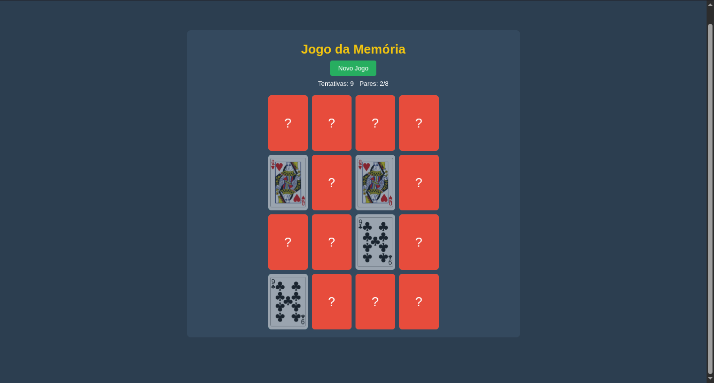

# Jogo da Memória com Baralho 🎴

Este é um projeto pessoal de um jogo da memória desenvolvido com HTML, CSS e JavaScript. O objetivo é praticar e aprimorar habilidades de front-end, criando um jogo interativo e divertido que utiliza a API Deck of Cards para gerar cartas aleatórias.

### 🎯 Funcionalidades
- **Baralho Real**: Utiliza a API Deck of Cards para gerar cartas reais
- **Sistema de Pontuação**: Contador de tentativas e pares encontrados
- **Interface Intuitiva**: Design limpo e fácil de usar
- **Responsividade**: Adaptável a diferentes tamanhos de tela
- **Animações**: Efeitos visuais ao virar as cartas

### 🚀 Como jogar
1. Clique no botão "Novo Jogo" para iniciar uma partida
2. As cartas serão embaralhadas e posicionadas aleatoriamente
3. Clique em uma carta para virá-la e revelar seu valor
4. Encontre todos os pares de cartas correspondentes
5. Tente completar o jogo com o menor número de tentativas possível

### 📊 Sistema de Pontuação
- **Tentativas**: Conta cada par de cartas viradas
- **Pares Encontrados**: Mostra seu progresso no jogo
- **Vitória**: Mensagem de parabéns ao encontrar todos os pares

### 🛠️ Tecnologias utilizadas
**HTML5**: Estrutura semântica do jogo  
**CSS3**: Estilização com design responsivo e animações  
**JavaScript**: Lógica do jogo e integração com API  
**Deck of Cards API**: Geração de cartas aleatórias

### Imagens do Projeto:
